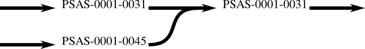
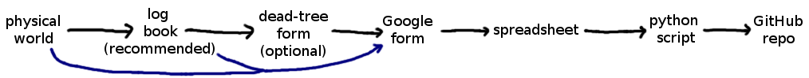
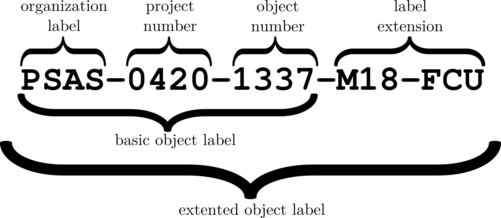

> **“**
>
> **The only ‘mandatory’ part of this asset tracking system is the Google form. Everything else is just a really good idea.**
>
> **”**

General Idea
============

This is a kind of minimum-effort asset tracking system. Individual projects are totally free to have more elaborate tracking systems, but the information in these [*forms*](https://goo.gl/forms/aUBfFy1wVYXFsTUE3) *should* be pertinent to any project that uses physical stuff. If people want to have more elaborate tracking systems, they put that metadata in the “message” section of the [*form*](https://goo.gl/forms/aUBfFy1wVYXFsTUE3).

Obviously, you can’t have *truly* mandatory requirements (not that we’d want any) in a volunteer-based, open-source group. **The only ‘mandatory’ part of this asset tracking system is the [*Google form*](https://goo.gl/forms/aUBfFy1wVYXFsTUE3). Everything else is just a really good idea.**

[*This is the Google drive folder*](https://drive.google.com/open?id=0B2nsckDcLaqgMU9rblVRaTdacTg) containing the [*form*](https://goo.gl/forms/aUBfFy1wVYXFsTUE3) ([*online*](https://goo.gl/forms/aUBfFy1wVYXFsTUE3) and [*paper*](https://drive.google.com/open?id=1l_SgsbHxSOygJ99tYX7hj7E63I54Lk37edlUR7ThFM4)) and the spreadsheet the online form writes to. The form is relatively painless to fill out.

Definition of a Project
-----------------------

**A project is a bunch of related work.** Relatedness is determined by the people doing the work. We don’t call it a “team,” since any one project may get abandoned and restarted by many groups of people.

If Alice, Bob, and Chuck are all working on the liquid engine and the cubesat, they will probably identify as two different projects, even though they’re the same people. Likewise, if Alice is only working on the thermal issues in the cubesat structure, while Bob and Chuck only work on vibrational issues in the structure, they would likely identify their work on the structure as just one project since their work is interdependent.

A good rule of thumb would be that each GitHub repo is a project. In practice many projects have more than one repo (slightly naughty), but virtually no repos have more than one project.

Definition an Asset
-------------------

**An ‘asset’ is whatever a team deems to be a useful unit to track.** If there’s no sane reason to take an impeller out of a pump housing, then they’re one asset. The term “asset” is used instead of “part” to avoid confusion with more elaborate capital P parts tracking systems.

If you’re working on a project with lots of small screws and it’s easier to just throw out a suspicious screw, you probably don’t want to track each screw. However, if you’re working on a project with $ 50 pipe adapters that take a month to order, you probably want to track those.

### Combined Assets

If you combine two assets into one, the asset number of the ‘central’ one is used to track that assembly. For example, if a fin labelled PSAS-0001-0045 gets epoxied to an airframe module labelled PSAS-0001-0031, then that fin-module assembly would be tracked as PSAS-0001-0031 (the label for the module). You’d submit one form for PSAS-0001-00045 saying, “this fin was epoxied to PSAS-0001-0031. It’s now tracked under that number,” and another form for PSAS-0001-0045 saying, “I epoxied on PSAS-0001-0045. This module is now a fin can.”

Similarly, if you plan to disassemble something and swap pieces out repeatedly, then you probably shouldn’t be tracking it as a single asset. For example, if you assemble airframe modules into a complete airframe, they’ll probably be disassembled immediately after flight and never exist in that configuration again. So, it’s more useful to keep tracking them as individual assets.

Flow of Information
-------------------

The blue paths are for slackers; try not to use them. The Python script and GitHub repo haven’t been implemented yet.

The log book is for the convenience of the people working on each project. It’s a “just write it down” sort of thing, so information isn’t lost forever. It will at least exist *somewhere*. The dead tree form is another convenience thing, since people may not have an internet connection. The Google form is the bottleneck that actually standardizes everyone’s logs. The spreadsheet just stores the form responses in chronological order. The python script just reads the data from the spreadsheet and writes it to the GitHub repo. The GitHub repo stores READMEs for each asset, containing all the logs for that asset (a mini log book for just that asset). Those are stored hierarchically by project/asset. The repo also holds ancillary media added by team members.

Label Specifications
====================

Basic Labels
------------

Each project has a 4-digit number and each asset within that project has another 4-digit number. **These numbers must be definite-positive whole numbers. They must contain the leading zeroes.** So, 0069 is fine. However, 69, -0069, 0000, and 69.2 are all unacceptable.

The physical assets may be labelled with their group label, project number, and part number separated by dashes or with a 3x4 grid containing the same information. So, for a project numbered 0420 and an asset numbered 1337, the following are both valid labels on a physical asset:

|                |     | PSAS |
|----------------|-----|------|
| PSAS-0420-1337 | or  | 0420 |
|                |     | 1337 |

If an asset *can* be labelled, it *should* be labelled, but use common sense. **Assets must never be labelled with something less than the basic label.** **Do not label an asset with just the asset number**, since this could cause confusion with off-the-shelf parts. For example, say two projects have a screwdriver with asset number 0050 and I say, “hey, don’t use screwdriver fifty, it’s covered in toxic schmoo.” It should be obvious there would be many problems. The reason for the “PSAS-” at the beginning is so assets can find their way back to us if they get lost.

Label Extensions
----------------

It’s acceptable to append a *label extension* to a basic asset label, as long as it conforms to these rules:

-   It MUST only contain letters (A-Z), numbers (0-9), and dashes(-) from the ASCII set.

-   It MUST begin with a letter, to avoid confusion with the asset number.

-   It MUST be separated from the basic label.

    -   When appearing in an inline label, use a dash.

    -   When appearing in the grid label, use a new line. (see below)

-   It SHOULD be all upper-case.

-   It SHOULD not change.

-   It MAY be absent when labelling or referring to the asset.

(or a newline, in the case of the 3x4 grid) and there are no spaces or special characters. For example, if you wanted to specify that an asset was an 18 inch module you might add “M18” to the extension, and if you wanted to specify that it was flight-quality, coated, and unflown you might add “FCU”. Here are some examples:

| PSAS-0420-1337-M18-FCU |     | PSAS |     | PSAS    |
|------------------------|-----|------|-----|---------|
| or                     |     | 0420 |     | 0420    |
| PSAS-0420-1337-M18FCU  | or  | 1337 | or  | 1337    |
| or                     |     | M18  |     | M18-FCU |
| PSAS-0420-1337         |     | FCU  |     |         |
| M18FCU                 |     |      |     |         |

Just remember that **the basic labels must be unique!** PSAS-0420-1337 and PSAS-0420-1337-M18-FCU refer to the *same asset*, since they have the *same basic label*.

Starting a Project
==================

Getting a Project Number
------------------------

Theoretically, every project should have a corresponding repository on GitHub. By default, the project name **really should be (!)** the *exact* name of that repo. If a project has more than one repo, that’s totally fine. It’s up to the people working on that project to designate a repo that identifies their project.

Look at the drop down list in [*the Google form*](https://goo.gl/forms/R5KgTsE6nVxJoR352) and the second sheet of the [*spreadsheet*](https://drive.google.com/open?id=1WGUDLZCfnx5XszbieqXB1CkXd4tUycS09PmUu7PM7fA). If your project does not appear on there, add it. (You may need to get someone with access to the “PSAS Leadership” drive folder to do this for you.) Your project number should be one more than the highest number in both those lists. (So, if the drop-down goes to 0025, but the spreadsheet only goes to 0022, just go with 0026 to avoid a potential collision.)

Creating a Log Book
-------------------

Each project should also have a physical log book, which just consists of some blank paper (pre-bound!) and some (3 to 10) [*dead-tree forms*](https://drive.google.com/open?id=1l_SgsbHxSOygJ99tYX7hj7E63I54Lk37edlUR7ThFM4). A copy of these instructions wouldn’t be a bad idea, while you’re at it. A $2 composition notebook with forms stuffed in the back would work. The log book should have the project name and 4-digit project number written clearly on the front. The inside cover should have the names, initials, and contact info of the project members. The first few pages (based on how many assets you expect to have in your project) should contain a list of asset numbers, names, and **either a unique description of the asset or a description of where to find its asset number**.

Maintaining a Project
=====================

Using a Log Book
----------------

**Write everything in the log book.** The log book does not need to be pretty or well-formatted. Just put stuff in it. Broken sentences and misspelled works are fine. Don’t let that information dissolve into the ether. If someone looks at your stuff and says something along the lines of, “what’s that,” “how’d this dent get here,” or “where’d this asset go,” they should eventually be able to figure it out with just the log book, given an arbitrary amount of time and internet searches.

The log book is not intended for anyone outside your project (you get major cool-kid points if outsiders can read it, though). The idea is that you have it with you when you’re working on stuff, so you can quickly jot down information. **Entries in the log book *really should* start with the asset number, date, and your initials** (maybe the time and place, too).

It’s totally okay to refer to an asset from another project in your project’s log book. Just make it clear which asset you’re referring to in the log entries and assets list. In fact, **if you absorb inventory from a defunct project** (or borrow something from an active project), **you should use the old labels for their assets. Each label refers to a unique physical asset.** If you *really* want to use a new label within your project, submit a form under the old label saying what the new label is. Then, submit a form under the new label saying what the old label was. (Thus, the two histories are linked together.) Ideally, you should also make corresponding log book entries.

Syncing the Log Book with the Spreadsheet
-----------------------------------------

When you’re done for the day or have time, transcribe the events that happened to your assets into the form (either the [*dead tree version*](https://drive.google.com/open?id=1l_SgsbHxSOygJ99tYX7hj7E63I54Lk37edlUR7ThFM4) or the [*online version*](https://goo.gl/forms/R5KgTsE6nVxJoR352)). Be sure to mark which log book entries have been transcribed. Double-entering data is a severe faux pas.

When you have time, check the dead tree forms in the back of your log book. If any are missing the checked box indicating they’ve been put into the Google form, input them into the Google form and check that box. (Double-entering is a faux pas!) Leave the forms in the back of your log book. Then, go through the log book and look for any entries that aren’t marked as having been transcribed into a form. If you find any, input them into the Google form and mark them. (remember the faux pas!)

The whole point of this system is to prevent information from disappearing. **If you aren’t sure whether something has already been entered, make a note of it in the “message” of the form and submit the form anyways**. That way, future rocketeers may be able to work out what happened if they need to.

Not Implemented Yet
===================

Parsing Script and GitHub Repo
------------------------------

It would be great to have a script that ran periodically and added any new entries in the spreadsheet to a GitHub repo. Rather than just being a stream of events throughout PSAS, the repo would organize things by project and asset.

The nice thing about this: it lives forever; people can add their own stuff to the project and asset directories if they want to; as long as the directory structures and file formats are specified well, the parsing script may be improved or replaced; **the README for each asset becomes a mini log book for that asset (extremely useful)**.

### Directory Structure

-   github.com/psas/psas-asset-tracking/

    -   README.md

    -   parser/

    -   0001/

        -   README.md

        -   logBook1scan.pdf

        -   0001/

            -   README.md

        -   0002/

            -   README.md

        -   0003/

            -   README.md

    -   0002/

        -   README.md

        -   0001/

            -   README.md

The “logBook1scan.pdf” file would be an example of a file that someone has gone in and manually added to the repo. Since the parsing script should only ever add stuff to the repo, it shouldn’t ever wipe out that file. (Of course, if people try to edit the READMEs that the script creates, they will have a nasty surprise when/if the script overwrites them.)

psas-asset-tracking/parser is, of course, where the parsing script lives.

### psas-asset-tracking/README.md 

This would contain an index of all the project numbers, their names, links to their repos, and links to their directories within the asset tracking repo. Preferably, the assets would be listed as sub-items in that index with their full asset label and their own links. It should also contain links to any extra files in the project directory. It might look something like this:

*psas-assets-tracking/README.md*

| \# PSAS asset tracking index                                                             
                                                                                           
 \* \[0001\](./0001) \[lv3.0-airframe\](https://github.com/psas/lv3.0-airframe)            
                                                                                           
 \* \[logBook1scan.pdf\](./0001/logBookScan.pdf)                                           
                                                                                           
 \* \[PSAS-0001-0001\](./0001/0001)                                                        
                                                                                           
 \* \[PSAS-0001-0002\](./0001/0002)                                                        
                                                                                           
 \* \[PSAS-0001-0003\](./0001/0003)                                                        
                                                                                           
 \* \[0002\](./0002) \[sw-cad-airframe-nsr\](https://github.com/psas/sw-cad-airframe-nsr)  
                                                                                           
 \* \[PSAS-0002-0001\](./0002/0001)                                                        |
|------------------------------------------------------------------------------------------|

### psas-asset-tracking/0001/README.md 

This would contain the name of the project, a link to its repo, and an index of the asset numbers, their names, and links to their directories. It might look something like this:

*psas-asset-tracking/0001/README.md *

<table>
<thead>
<tr class="header">
<th>
# 0001 [lv3.0-airframe](https://github.com/psas/lv3.0-airframe)

* [logBook1scan.pdf](./logBookScan.pdf)

* [PSAS-0001-0001 “18 inch module”](./0001)

* [PSAS-0001-0002 “24 inch module”, “fin can”](./0002) 
* [PSAS-0001-0003 “nosecone”](./0003)
</th>
</tr>
</thead>
<tbody>
</tbody>
</table>

Note that PSAS-0001-0002 has two names listed. This would be an important feature in the parsing script, to sort the names the asset has been given with respect to time. Inevitably, assets will have different descriptions over time. (A 24 inch module becomes a fin can when fins are attached to it.)

### psas-asset-tracking/0001/0002/README.md

**I leave it to the computer scientists to ordain the best format for this file.** (I’m guessing it will be something like JSON, YAML, or TeXinfo.) I do have some requirements for it though:

-   It **MUST** be human readable.

    -   The human in this case is a ME student who doesn’t know the precise syntax, **NOT** a CS student who already knows the precise syntax, and certainly not the person writing the parsing script! i.e., go find a sophomore ME student who hasn’t seen your sample file yet and ask them what it means.

-   The events MUST be sorted with respect to time, with the earliest events first.

-   The parsing script SHOULD be tracked in the repo. (If it’s too sketchy to have it edit its own repo, it’s fine to put it in another one… but it really should be in the asset tracking repo.)

-   Each event SHOULD contain all the info from its line in the spreadsheet.

-   It SHOULD be clear what info belongs to which event.

-   Someone SHOULD be able to read through it and understand the history of the asset. (Though, that mostly depends on the person who wrote the messages.)

-   It SHOULD contain the name of the project it belongs to, along with a link to that GitHub repo.

-   It SHOULD contain links to any other files in that asset’s directory.

Web-based Interface
-------------------

It would be super spiffy if we had some little standalone Javascript thing that could be used to search the GitHub repo without cloning it, since searching for stuff through the GitHub site is terrible. That’s deep into “extra” territory though. The use case for this would be someone who doesn’t have their log book or laptop, but needs to know the history of an asset (search for asset labels). Maybe the physical label is unreadable (search for asset names). Maybe they need to know which asset received a certain treatment (search for keywords in messages).

With something like this, someone could reasonably submit (via the Google form) and read (via the web app) asset event logs entirely from their smartphone.
